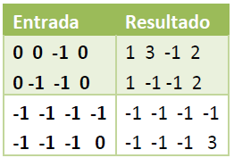

# UD02. Sintaxis del Lenguaje JavaScript - Actividades

## Actividad 1: Contar Cartas

En el juego de casino Blackjack, un jugador puede determinar si tiene una ventaja sobre la casa en la próxima mano al realizar un seguimiento del número relativo de cartas altas y bajas que quedan en la baraja. Esto se llama Conteo de Cartas.

Tener más cartas altas restantes en el mazo favorece al jugador. A cada carta se le asigna un valor de acuerdo con la siguiente tabla:

| Conteo | Cartas                  |
|--------|-------------------------|
| +1     | 2, 3, 4, 5, 6           |
| 0      | 7, 8, 9                 |
| -1     | 10, 'J', 'Q', 'K', 'A'  |

Escribe una función para contar cartas. Recibirá un parámetro llamado `card`, que puede ser un número o una cadena, e incrementará o decrementará la variable `count` global según el valor de la carta. La función luego devolverá una cadena con el conteo actual y la cadena de texto "Bet" si el conteo es positivo, o "Hold" si el conteo es cero o negativo. El conteo actual y la decisión del jugador (`Bet` o `Hold`) deben estar separados por un solo espacio.

**Ejemplo de salida:** `-3 Hold` o `5 Bet`.

---

## Actividad 2: Cálculo de Salario

Escribe una función que reciba dos parámetros: número de horas trabajadas y precio por hora. Después, llama a la función para probar que funciona.

La función debe calcular el salario neto semanal de un trabajador en función del número de horas trabajadas y la tasa de impuestos de acuerdo a las siguientes reglas:

- Las primeras 35 horas se pagan a tarifa normal.
- Las horas que pasen de 35 se pagan a 1.5 veces la tarifa normal.

Al sueldo bruto se le aplicarán las siguientes tasas de impuestos:

- Los primeros 500 euros son libres de impuestos.
- Los siguientes 400 tienen un 25% de impuestos.
- Los restantes tienen un 45% de impuestos.

Imprime por consola el salario calculado.

---

## Actividad 3: Números Pares

Realiza un programa que lea un número `N` y muestre por consola todos los números pares desde 2 hasta `N` (inclusive).

Cada número se mostrará en una línea distinta.

**Nota:** `N` siempre será mayor o igual a 2.

---

## Actividad 4: Números Impares

Realiza un programa que lea un número `N` y muestre por consola todos los números impares desde `N` (inclusive) hasta 1.

Cada número se mostrará en una línea distinta.

**Nota:** `N` siempre será mayor o igual a 1.

---

## Actividad 5: Cambio de Dinero

Realiza un programa que lea una cantidad de dinero (múltiplo de 5) y desglose el cambio en billetes de 500, 200, 100, 50, 20, 10, 5, intentando dar el mínimo número de billetes.

El programa mostrará por consola el número mínimo de billetes de cada cantidad.

---

## Actividad 6: Contar Patrones
Realiza una aplicación web que solicite una cadena de texto.

El programa debe contar cuántas veces ocurren los siguientes patrones sin distinguir entre mayúsculas y minúsculas: “00”, “101”, “ABC”, “HO”.

Un carácter puede formar parte de más de un patrón encontrado. Por ejemplo, en la cadena “000” el patrón “00” aparece dos veces (una empieza en la posición 0 y otra empieza en la posición 1).

Internamente, el programa contará los patrones con una función definida como:
**function numeroPatrones(texto)** que devolverá un número entero con el número de patrones encontrados.

---

## Actividad 7: Buscaminas

Realiza una función que reciba un array bidimensional (de longitud variable) con un escenario de Buscaminas, donde haya un `0` donde no hay minas y un `-1` donde sí hay.

Para cada casilla que no tenga una mina, la función deberá contar cuántas minas adyacentes hay en diagonal, horizontal y vertical. 

Internamente, el programa realizará las acciones con una función definida como:

```javascript
function contandoMinas(Campo)
```
La función devolverá un array bidimensional con el numero de minas adyacentes en cada posición.
Por ejemplo:


---

## Actividad 8: Verificación de Sudoku
Realiza una aplicación web que compruebe si una solución de un Sudoku es correcta o no.

La aplicación debe tener un tablero de 9x9 campos de texto y un botón "Comprobar". Se recomienda utilizar un valor por defecto de un Sudoku válido para hacer pruebas.

Las reglas del Sudoku están disponibles en [Wikipedia.](https://es.wikipedia.org/wiki/Sudoku)

Internamente, el programa comprobará la solución con una función definida como:
**function esSudokuCorrecto(miArrayBi)** que devolverá true si es correcto, false en caso contrario.
