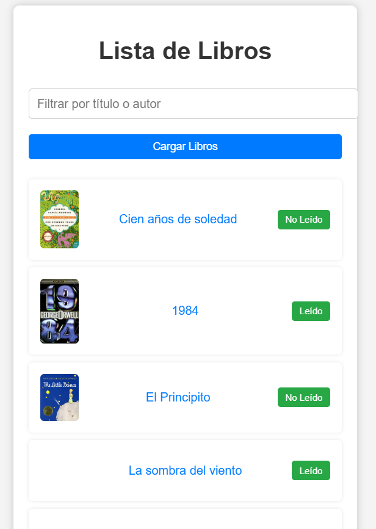
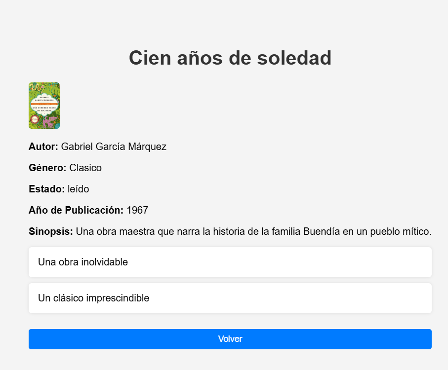
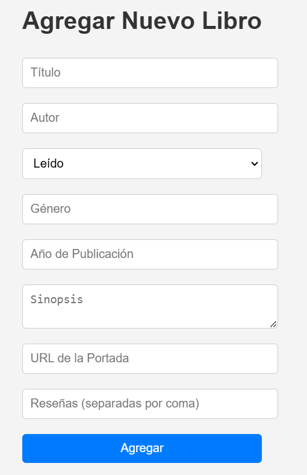

# 📄 Prueba Técnica: "Gestor de Libros" con Vue.js

## 📌 Objetivo  
Desarrollar una aplicación web en **Vue.js** que permita gestionar una lista de libros utilizando una API REST. La aplicación debe permitir visualizar, filtrar, agregar y modificar el estado de lectura de un libro, asegurando la correcta comunicación con el backend mediante peticiones HTTP.

🔗 **API a utilizar:**  
[Documentación Swagger](https://libros-back-2kac.onrender.com/api-docs/)

---

## 📌 Requerimientos de la Aplicación  

### 🖥️ Vistas de la aplicación  
La aplicación contará con las siguientes vistas, gestionadas con **Vue Router**:

### 1️⃣ 📜 Vista Home  
- Muestra la lista de libros obtenida desde la API.
- Muestra por cada libro **su portada y título**.
- Permite filtrar la lista de libros por:
  - **Género:** `"Clasico"`, `"Drama"`, `"Fantasia"`, `"Misterio"`.
  - **Estado:** `"leído"` o `"no leído"`.
- Botón **"Agregar Libro"** para navegar a la vista de creación.
- **Funcionalidad clave:**  
  - **Botón para cambiar el estado de un libro entre "leído" y "no leído"** sin necesidad de abrir otra vista.  
  - Este cambio se debe reflejar en la API y actualizarse en la vista sin recargar la página.
  

### 2️⃣ 📖 Vista de Detalle  
- Al hacer clic en un libro en la Vista Home, se mostrará su información completa:
  - **Título, autor, estado, género, año de publicación, sinopsis, portada y reseñas**.
- Botón **"Volver"** para regresar a la Vista Home.
  


### 3️⃣ 📝 Vista de Agregar Libro  
- Formulario para **crear un nuevo libro**.
- Todos los campos son obligatorios.
- Tras enviar el formulario, el libro se debe agregar a la API y reflejarse en la Vista Home sin necesidad de recargar la página.
- Validaciones para evitar el envío de datos incompletos.

---

## 📌 Marcar un Libro como "Leído" o "No leído"  
En la **Vista Home**, se debe permitir al usuario cambiar el estado de lectura de un libro sin necesidad de ir a otra vista.

### 📌 ¿Cómo se implementará?
- Cada libro en la **Vista Home** tendrá un **botón dinámico** que cambiará según el estado actual del libro:
  - 📖 **Si el libro está "no leído"**, el botón mostrará: `"Marcar como leído"`.  
  - ✅ **Si el libro está "leído"**, el botón mostrará: `"Marcar como no leído"`.  
- Al hacer clic en el botón, se debe enviar una **petición a la API** para actualizar el estado del libro.
- Una vez actualizado en la API, la **Vista Home se actualizará automáticamente** sin necesidad de recargar la página.

### 📌 Ejemplo de Interacción
| Estado Actual  | Botón Disponible | Nuevo Estado Tras Clic |
|---------------|----------------|----------------|
| No leído     | 📖 Marcar como leído | ✅ Leído |
| Leído        | ❌ Marcar como no leído | 📖 No leído |

---

## 📌 Datos de ejemplo para agregar un nuevo libro  

Cuando se agregue un nuevo libro, se debe enviar un JSON con el siguiente formato:

```json
{
  "titulo": "Nuevo Libro",
  "autor": "Autor de Prueba",
  "estado": "leído",
  "genero": "Clasico",
  "añoPublicacion": 2024,
  "sinopsis": "Este es un libro de prueba.",
  "portada": "https://example.com/portada.jpg",
  "resenas": ["Muy interesante", "Lectura recomendada"]
}
```

---

## 📌 Criterios de Corrección (Máximo: 10 Puntos)  
La prueba se evaluará sobre un total de **10 puntos**, divididos en los siguientes criterios:

| **Criterio** | **Descripción** | **Puntos** |
|-------------|----------------|------------|
| **1. Vista Home (2 puntos)** | Se muestra correctamente la lista de libros obtenida desde la API, con portada y título. | **2** |
| **2. Filtrado de Libros (1 punto)** | Los filtros por **género** y **estado** funcionan correctamente. | **1** |
| **3. Funcionalidad "Marcar como leído/no leído" (2 puntos)** | El botón cambia el estado de lectura del libro y la vista se actualiza sin recargar la página. | **2** |
| **4. Vista de Detalle (2 puntos)** | Al hacer clic en un libro, se muestra su información detallada correctamente. | **2** |
| **5. Agregar un Nuevo Libro (2 puntos)** | El formulario de agregar un libro funciona correctamente, enviando los datos a la API y reflejando el nuevo libro en la lista. | **2** |
| **6. Validaciones en el Formulario (1 punto)** | No permite enviar datos incompletos o incorrectos en la creación de un libro. | **1** |

### 🔹 Notas adicionales:
- **Errores críticos:** Si la aplicación no se conecta correctamente con la API o no carga los libros en la Vista Home, se descontarán puntos según la gravedad del fallo.  
- **Extras:** Se pueden otorgar puntos adicionales (hasta **1 punto extra**) si la aplicación incluye mejoras en la UI, animaciones o mejor manejo de errores.  

---

✅ **Con este enunciado, los desarrolladores tendrán claras las funcionalidades a implementar y cómo serán evaluados. Además, la funcionalidad de cambiar el estado de lectura se ha explicado detalladamente para facilitar su implementación.** 🚀
