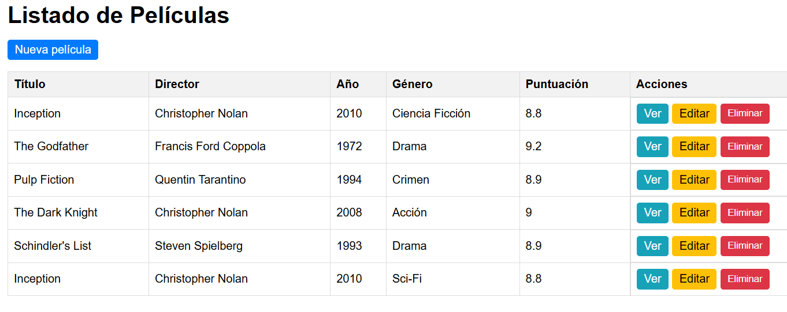
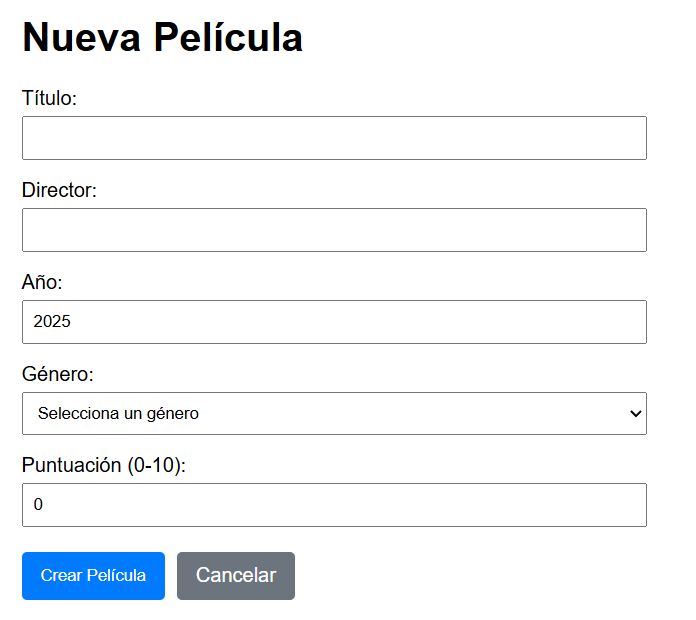
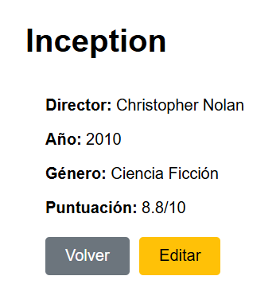
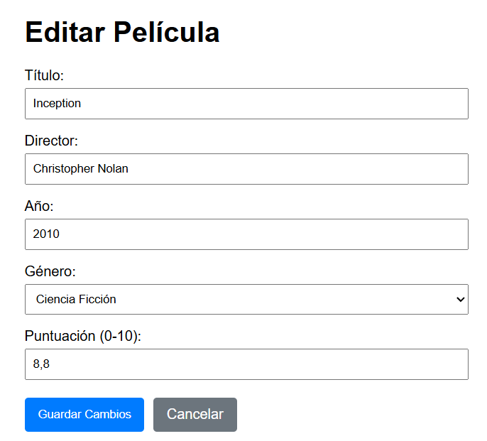
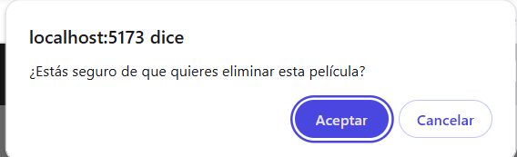

# 📌 PRUEBA TÉCNICA - GESTOR DE PELÍCULAS EN VUE

## 📝 Introducción
Desarrolla una aplicación en **Vue 3** que gestione un catálogo de **películas** mediante una **API REST**. Implementa un CRUD completo usando **Vue Router** y **Axios**.

El objetivo es demostrar que sabes consumir una API, manejar eventos y formularios en Vue y aplicar validaciones básicas.

---

## 📌 Requisitos técnicos
- ✅ **Vue 3 + Composition API**
- ✅ **Vue Router** para la navegación
- ✅ **Axios** para las llamadas HTTP
- ✅ Reactividad y eventos en Vue
- ✅ Formularios con validaciones básicas

> *Puedes usar Pinia si lo deseas, pero no es obligatorio.*

---

## 💯 API REST
Utiliza la API documentada en **[API Películas](http://qg88088c0sow0w4cccwgowco.51.210.104.106.sslip.io/api-docs)**. Endpoints principales:

| Operación | Método & URL |
|-----------|--------------|
| Obtener lista de películas | `GET http://qg88088c0sow0w4cccwgowco.51.210.104.106.sslip.io/movies` |
| Obtener detalles de una película | `GET http://qg88088c0sow0w4cccwgowco.51.210.104.106.sslip.io/movies/:id` |
| Crear película | `POST http://qg88088c0sow0w4cccwgowco.51.210.104.106.sslip.io/movies` |
| Editar película | `PUT http://qg88088c0sow0w4cccwgowco.51.210.104.106.sslip.io/movies/:id` |
| Eliminar película | `DELETE http://qg88088c0sow0w4cccwgowco.51.210.104.106.sslip.io/movies/:id` |

---

## 🛠 Funcionalidades obligatorias
Cada funcionalidad se evalúa por separado y suma hasta **10 puntos**.

### 1️⃣ Listado de películas (2 pts)
* **Ruta:** `/peliculas`
* Obtén la lista con **GET** y muéstrala en una tabla o grid con:
  * **Título, Director, Año, Género, Puntuación** y **Acciones** (Ver, Editar, Eliminar).
* Botón **“Nueva película”** para ir al formulario de alta.

---

### 2️⃣ Crear película (2 pts)
* **Ruta:** `/peliculas/nueva`
* Formulario con los campos:
  * **Título** (mínimo 2 caracteres)
  * **Director** (obligatorio)
  * **Año** (número de 4 dígitos, entre 1900 y el año actual)
  * **Género** (`Acción`, `Comedia`, `Drama`, `Terror`, `Ciencia Ficción`)
  * **Puntuación** (0 a 10)
* No permitir enviar si hay campos vacíos o inválidos.
* Al enviar, realiza **POST** y **redirecciona** a la lista actualizada.

---

### 3️⃣ Ver detalles de película (1,5 pts)
* **Ruta:** `/peliculas/:id`
* Muestra los datos de la película obtenidos con **GET**, incluyendo la carátula (si la API la provee) o una imagen por defecto.
* Botón **“Volver”** para regresar al listado.

---

### 4️⃣ Editar película (2 pts)
* **Ruta:** `/peliculas/:id/editar`
* Precarga los datos en el mismo formulario del alta.
* Valida igual que en “Crear” y envía **PUT** al guardar.
* Tras guardar, redirecciona al listado y actualiza la tabla.

---

### 5️⃣ Eliminar película (1,5 pts)
* **Desde la tabla** en `/peliculas`
* Botón “Eliminar” con **diálogo de confirmación**.
* Si se confirma, ejecuta **DELETE** y refresca la lista.

---

## 📌 Puntuación

| Funcionalidad | Puntos |
|---------------|--------|
| 1. Listado de películas | **2** |
| 2. Crear película | **2** |
| 3. Ver detalles | **1,5** |
| 4. Editar película | **2** |
| 5. Eliminar película | **1,5** |
| **TOTAL** | **10** |
