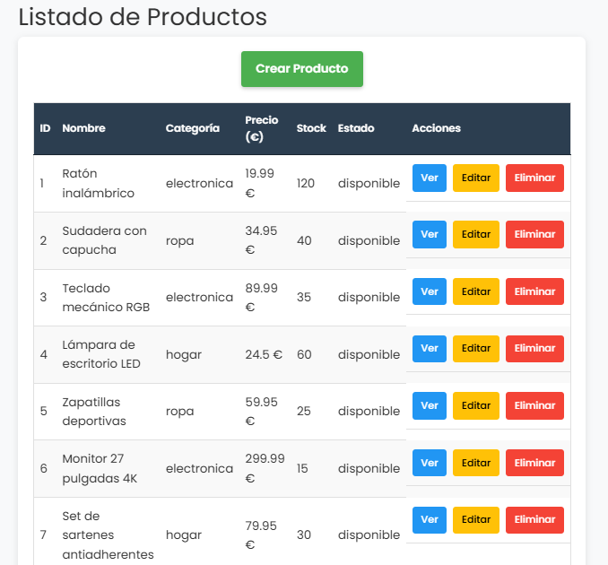
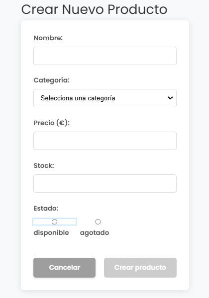
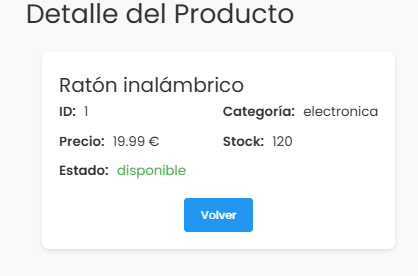
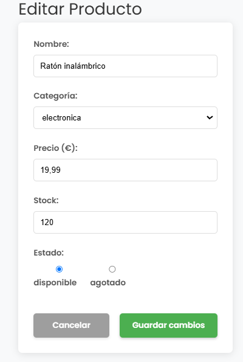
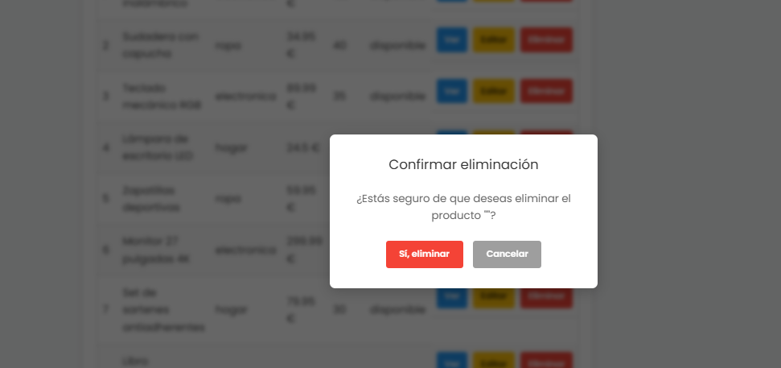

# 📌 PRUEBA TÉCNICA RECUPERACIÓN JUNIO – GESTOR DE PRODUCTOS EN VUE

## 📝 Introducción
Desarrolla una aplicación en **Vue 3** que gestione un catálogo de **productos** mediante una **API REST**. Implementa un CRUD completo usando **Vue Router** y **Axios**.

El objetivo es demostrar que sabes consumir una API, manejar eventos y formularios en Vue y aplicar validaciones básicas.

---

## 📌 Requisitos técnicos
- ✅ **Vue 3 + Composition API**
- ✅ **Vue Router** para la navegación
- ✅ **Axios** para las llamadas HTTP
- ✅ Reactividad y eventos en Vue
- ✅ Formularios con validaciones básicas

> *Puedes usar Pinia si lo deseas, pero no es obligatorio.*

---

## 💯 API REST
Utiliza la API documentada en **[API Productos](https://products-api-a351.onrender.com/api-docs/)**. Endpoints principales:

| Operación | Método & URL |
|-----------|--------------|
| Obtener lista de productos | `GET https://products-api-a351.onrender.com/products` |
| Obtener detalles de un producto | `GET https://products-api-a351.onrender.com/products/:id` |
| Crear producto | `POST https://products-api-a351.onrender.com/products` |
| Editar producto | `PUT https://products-api-a351.onrender.com/products/:id` |
| Eliminar producto | `DELETE https://products-api-a351.onrender.com/products/:id` |

---

## 🛠 Funcionalidades obligatorias
Cada funcionalidad se evalúa por separado y suma hasta **10 puntos**.

### 1️⃣ Listado de productos (2 pts)
* **Ruta:** `/productos`
* Obtén la lista con **GET** y muéstrala en una tabla con las columnas:
  * **ID, Nombre, Categoría, Precio (€), Stock, Estado** y **Acciones** (Ver, Editar, Eliminar).
* Botón **“Crear producto”** para ir al formulario de alta.

---

### 2️⃣ Crear producto (2 pts)
* **Ruta:** `/productos/nuevo`
* Formulario con los campos:
  * **Nombre** (mínimo 3 caracteres)
  * **Categoría** (`electronica`, `ropa`, `hogar`, `otros`)
  * **Precio** (número positivo)
  * **Stock** (entero ≥ 0)
  * **Estado** (`disponible` / `agotado`)
* No permitir enviar si hay campos vacíos o inválidos.
* Al enviar, realiza **POST** y **redirecciona** a la lista actualizada.

---

### 3️⃣ Ver detalles de producto (1,5 pts)
* **Ruta:** `/productos/:id`
* Muestra los datos del producto obtenidos con **GET**.
* Botón **“Volver”** para regresar al listado.

---

### 4️⃣ Editar producto (2 pts)
* **Ruta:** `/productos/:id/editar`
* Precarga los datos en el mismo formulario del alta.
* Valida igual que en “Crear” y envía **PUT** al guardar.
* Tras guardar, redirecciona al listado y actualiza la tabla.

---

### 5️⃣ Eliminar producto (1,5 pts)
* **Desde la tabla** en `/productos`
* Botón “Eliminar” con **diálogo de confirmación**.
* Si se confirma, ejecuta **DELETE** y refresca la lista.

---

## 📌 Puntuación

| Funcionalidad | Puntos |
|---------------|--------|
| 1. Listado de productos | **2** |
| 2. Crear producto | **2** |
| 3. Ver detalles | **1,5** |
| 4. Editar producto | **2** |
| 5. Eliminar producto | **1,5** |
| **TOTAL** | **10** |

---

