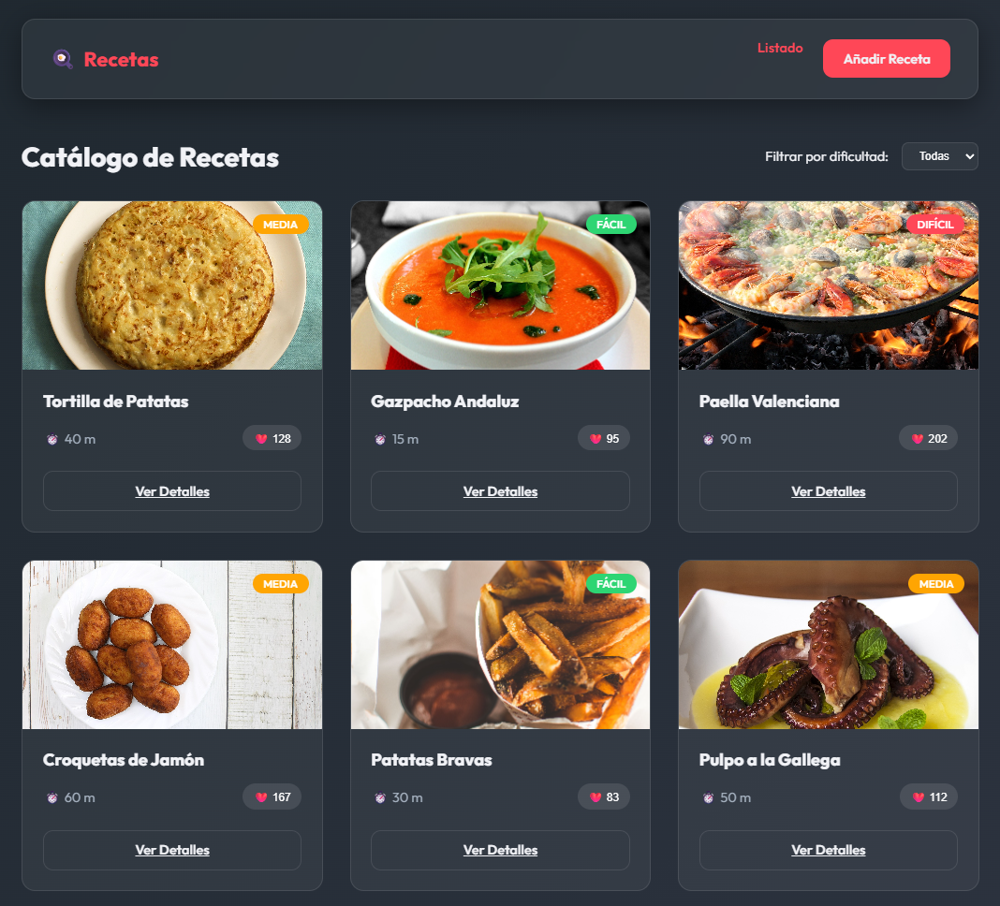
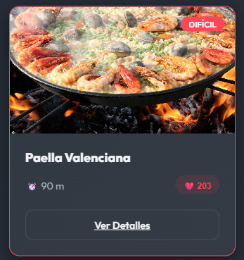
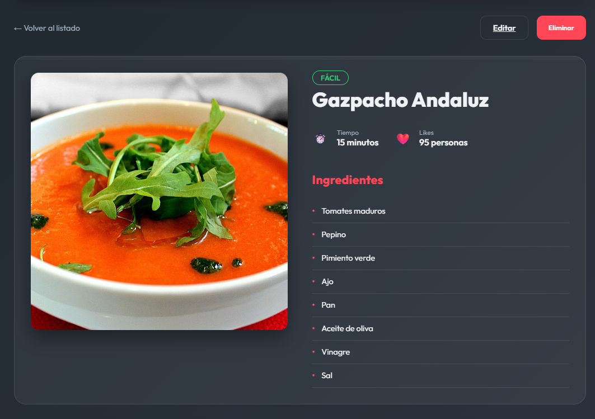
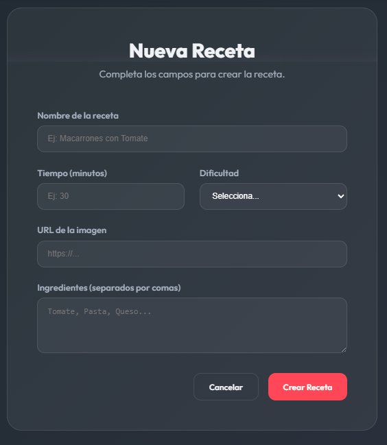
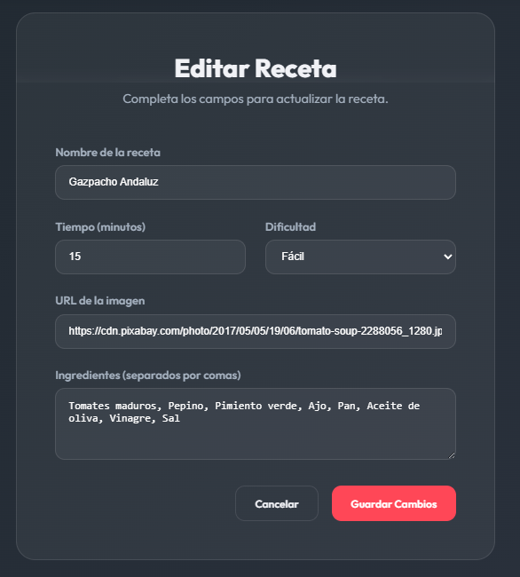

# 📌 PRUEBA TÉCNICA – GESTOR DE RECETAS EN VUE

## 📝 Introducción
Desarrolla una aplicación en **Vue** que gestione un catálogo de **recetas de cocina** mediante una **API REST**. Deberás implementar un **CRUD completo** utilizando **Vue Router** y **Axios**.

El objetivo es evaluar tu capacidad para consumir una API REST, manejar formularios con validaciones, y crear interfaces reactivas. Aunque sea un CRUD, deberás implementar algunas variantes en la presentación y flujo respecto a otras pruebas.

---

## 📌 Requisitos técnicos
- ✅ **Vue 3 + Composition API**
- ✅ **Vue Router** para la navegación
- ✅ **Axios** para las llamadas HTTP
- ✅ Reactividad y eventos
- ✅ Formularios con validaciones visuales

---

## 💯 API REST
Utiliza la API documentada en **[http://vww8swswookc0scksg08go0g.51.210.104.106.sslip.io/api-docs/]**. Endpoints principales:

| Operación | Método & URL |
|-----------|--------------|
| Obtener lista de recetas | `GET /recipes` |
| Obtener detalles de una receta | `GET /recipes/:id` |
| Crear receta | `POST /recipes` |
| Editar receta | `PUT /recipes/:id` |
| Eliminar receta | `DELETE /recipes/:id` |
| Actualizar "Me gusta" | `PATCH o PUT /recipes/:id` |

---

## 🛠 Funcionalidades obligatorias
Cada funcionalidad se evalúa por separado y suma hasta **10 puntos**.

### 1️⃣ Listado de recetas en formato "Grid" (2 pts)
📌 **Ruta:** `/recetas`
* A diferencia de otros ejercicios, **NO uses una tabla**. Muestra las recetas como **Tarjetas (Cards)** en un Grid (cuadrícula).
* Cada tarjeta debe mostrar: **Imagen destacada, Nombre de la receta, Nivel de dificultad, Tiempo de preparación** y el número de **Me gustas (❤️)**.
* Añade un **desplegable (select)** en la parte superior para **filtrar por dificultad** (Fácil, Media, Difícil). El filtrado debe realizarse dinámicamente en el frontend sobre la lista obtenida de la API.
* Botón **"Añadir Receta"** para ir al formulario de creación.



---

### 2️⃣ Reacción interactiva: Botón "Me gusta" (1,5 pts)
* En cada tarjeta del listado anterior (o bien dentro del detalle de la receta), implementa un botón interactivo (❤️).
* Al pulsar el botón, incrementa en 1 los "Me gustas" de esa receta enviando la petición correspondiente a la API.
* El número de "Me gustas" debe actualizarse en la tarjeta o detalle de forma **reactiva**, sin necesidad de recargar toda la página y sin que se pierda la posición actual del scroll.



---

### 3️⃣ Ver Detalle y Eliminar (2 pts)
📌 **Ruta:** `/recetas/:id`
* Al hacer clic en una tarjeta, navega al detalle de la receta obteniendo sus datos completos desde la API de forma individual.
* Muestra de forma clara y atractiva: **Imagen grande, Nombre, Tiempo, Dificultad y una lista de Ingredientes** (con viñetas). Además también aparecerán los botones de **"Editar"** y **"Eliminar"**.
* Si el usuario pulsa **Eliminar**, muestra un diálogo de confirmación (`confirm`). Si acepta, realiza el **DELETE** y redirige automáticamente al Listado general (`/recetas`).
* Botón **"Volver al listado"** para regresar sin hacer nada.



---

### 4️⃣ Añadir nueva receta con validación visual (2,5 pts)
📌 **Ruta:** `/recetas/nueva`
* Formulario para dar de alta una receta con los siguientes campos y validaciones:
  * **Nombre**: Obligatorio, mínimo 3 letras.
  * **URL de Imagen**: Obligatorio, debe empezar por `http://` o `https://`.
  * **Tiempo (minutos)**: Entero mayor a 0.
  * **Dificultad**: Select obligatorio (`Fácil`, `Media`, `Difícil`).
  * **Ingredientes**: Un `textarea` multicampo. (Por ejemplo, pide al usuario que separe los ingredientes por comas y antes de enviarlo a la API conviértelo en un Array de strings).
* **Validación visual:** Muestra un **mensaje de error en rojo** bajo cada campo en el momento en que pierda el foco (`blur`) o al intentar enviar si es inválido.
* Al enviar el formulario (POST), redirige al Listado general tras confirmar el éxito.



---

### 5️⃣ Editar receta (2 pts)
📌 **Ruta:** `/recetas/:id/editar`
* Carga de antemano (`onMounted`) los datos de la receta desde la API de forma individual en el formulario.
* El campo de ingredientes (textarea) debe repoblarse correctamente (uniendo el Array en un texto separado por comas).
* Mantiene las mismas reglas de validación que el formulario de creación.
* Al enviar exitosamente el formulario editado (PUT), **redirige a la vista de Detalle de la misma receta**, NO al listado general, para que el usuario pueda ver sus cambios reflejados.



---

## 📌 Puntuación

| **Funcionalidad** | **Puntos** |
|---|---|
| **1. Listado Grid y Filtro frontal** | 2 puntos |
| **2. Reactividad local: Dar "Me gusta"** | 1,5 puntos |
| **3. Vista Detalle con función Eliminar** | 2 puntos |
| **4. Formulario de Alta con transformaciones (Array) y validación visual** | 2,5 puntos |
| **5. Editar Receta y redirección a Detalle** | 2 puntos |
| **TOTAL** | **10 puntos** |

```
