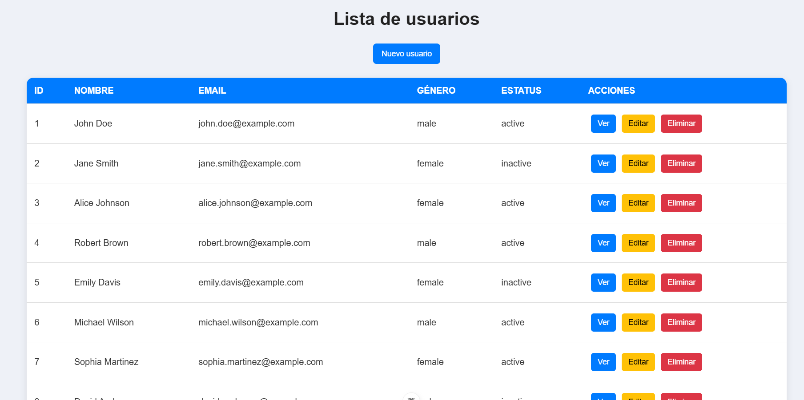
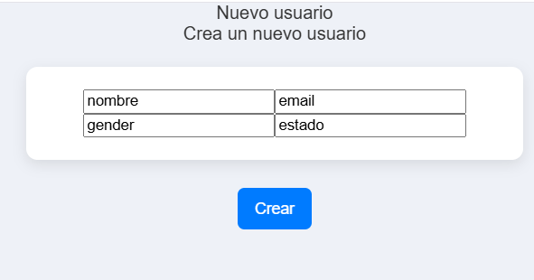
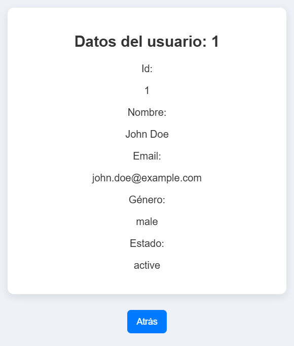
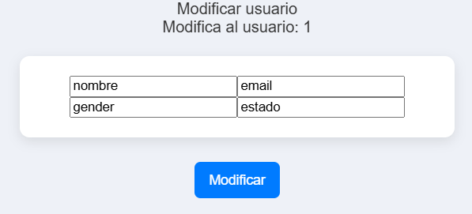
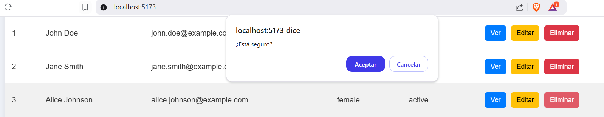

# 📌 PRUEBA TÉCNICA FINAL – GESTOR DE USUARIOS EN VUE

### 📝 Introducción
En esta prueba técnica vas a desarrollar una aplicación en **Vue** que permite gestionar una lista de usuarios mediante una API REST. Deberás implementar un **CRUD completo** utilizando Vue Router y Axios.

El objetivo es evaluar tu capacidad para consumir una API REST, manejar eventos en Vue y trabajar con formularios con validaciones básicas.

---

## 📌 Requisitos técnicos
✅ **Vue**  
✅ **Vue Router** para la navegación  
✅ **Axios** para realizar las llamadas a la API  
✅ **Uso de eventos y reactividad en Vue**  
✅ **Formularios con validaciones básicas**  

No es obligatorio usar **Pinia**, pero puedes utilizarlo si lo prefieres.

---

## 💯 API REST
La API que debes utilizar está documentada en **[API Usuarios](https://api-usuarios-js.onrender.com/api-docs/)**. Los endpoints principales son:

📌 **Obtener lista de usuarios:**  
`GET https://api-usuarios-js.onrender.com/users`

📌 **Obtener detalles de un usuario:**  
`GET https://api-usuarios-js.onrender.com/users/:id`

📌 **Crear usuario:**  
`POST https://api-usuarios-js.onrender.com/users`

📌 **Editar usuario:**  
`PUT https://api-usuarios-js.onrender.com/users/:id`

📌 **Eliminar usuario:**  
`DELETE https://api-usuarios-js.onrender.com/users/:id`

---

## 🛠 Funcionalidades obligatorias
Cada funcionalidad será evaluada de manera independiente con una puntuación específica.

### **1️⃣ Listado de usuarios (2 puntos)**
📌 **Ruta:** `/usuarios`  
- Obtener la lista de usuarios desde la API y mostrarla en una tabla.  
- La tabla debe incluir: **ID, Nombre, Email, Género, Estado y Acciones (Ver, Editar, Eliminar)**.  
- Botón para **crear un nuevo usuario**.  

---

### **2️⃣ Crear usuario (2 puntos)**
📌 **Ruta:** `/usuarios/nuevo`  
- Formulario con los siguientes campos:  
  - **Nombre** (mínimo 3 caracteres).  
  - **Email** (validado con regex).  
  - **Género** (`male` o `female`).  
  - **Estado** (`active` o `inactive`).  
- No permitir enviar el formulario con campos vacíos.
- Al enviar el formulario, realizar una petición **POST** a la API.  
- Al guardar, **redireccionar al listado y actualizar la tabla**.  

---

### **3️⃣ Ver detalles de usuario (1.5 puntos)**
📌 **Ruta:** `/usuarios/:id`  
- Obtener los datos del usuario con **GET** y mostrarlos en una vista.  
- Botón para volver a la lista de usuarios.  

---

### **4️⃣ Editar usuario (2 puntos)**
📌 **Ruta:** `/usuarios/:id/editar`  
- Cargar los datos del usuario en un formulario.  
- Permitir la edición y enviar la actualización con **PUT**.  
- No permitir guardar si los campos quedan vacíos o si el email no es válido.  
- Al guardar, **redireccionar al listado y actualizar la tabla**.  

---

### **5️⃣ Eliminar usuario (1.5 puntos)**
📌 **Desde la tabla de usuarios**  
- Botón para eliminar un usuario.  
- Antes de eliminar, mostrar un **diálogo de confirmación**.  
- Al confirmar, realizar un **DELETE** y actualizar la tabla.  

---

## **📌 Puntuación**
Cada funcionalidad se evalúa de manera independiente, sumando un **máximo de 10 puntos**.

| **Funcionalidad**                | **Puntos** |
|----------------------------------|------------|
| **1. Listado de usuarios**       | 2 puntos |
| **2. Crear usuario**             | 2 puntos |
| **3. Ver detalles de usuario**   | 1.5 puntos |
| **4. Editar usuario**            | 2 puntos |
| **5. Eliminar usuario**          | 1.5 puntos |
| **TOTAL**                        | 10 puntos |

---

